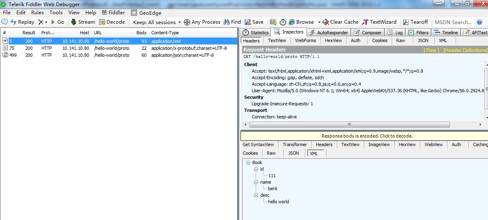
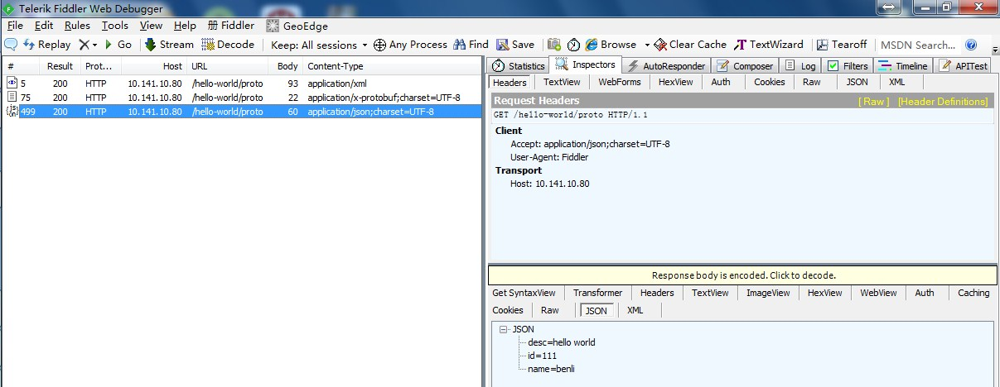

# testProtobuf
测试Protobuf再spring boot中的使用

可以不使用Nginx，本地测试的时候只需要运行，修改测试程序的ip和端口即可。

## 编译环境

IntelliJ IDEA Community Edition 2016.1.2(64)、jdk1.8

## 结果图

## 相关项目

[iOS版本测试项目](https://github.com/vcredit-zj/testProtobuf-iOS)

[Android版本测试项目](https://github.com/vcredit-zj/XiaoWuWeather)
